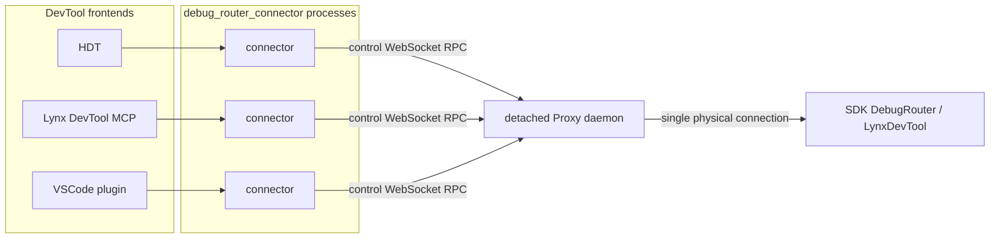
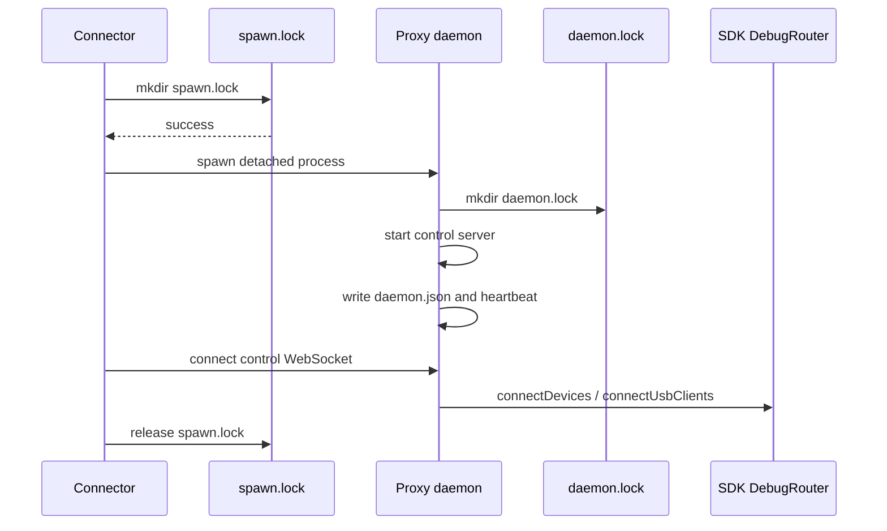
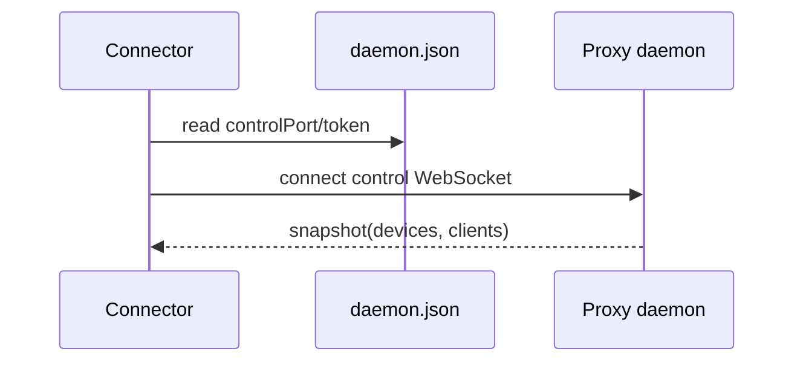
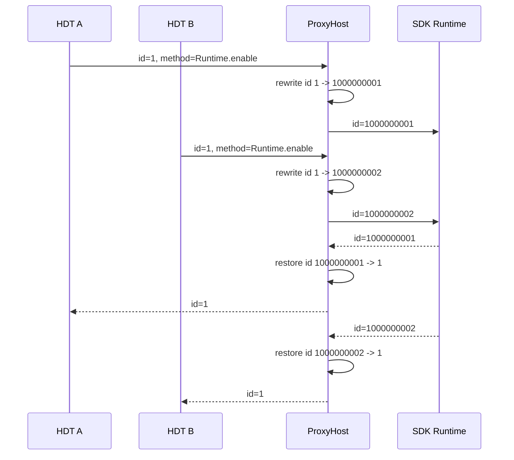

# DebugRouter Proxy 技术方案

## 1. 背景

`debug_router` SDK 侧当前只能同时维持一个 DevTool 前端连接。如果多个前端进程同时启动，例如 HDT、Lynx DevTool MCP、VSCode 插件等，它们都通过 `debug_router_connector` 直接连接 SDK 侧 DevTool，就会发生连接抢占，表现为后启动的前端抢走 SDK 侧连接，旧前端被断开并弹出提示。

这类冲突的根因不是端口本身，而是 SDK 侧 DebugRouter 的连接模型是单前端独占。SDK 侧 native 代码里只保存一个当前 transceiver 或 USB client，新连接会替换旧连接。因此，如果直接把多个前端都接到 SDK，冲突无法在前端工具之间自然消失。

本方案在 `debug_router_connector` 内引入 DebugRouter Proxy，把多前端并发问题收敛到 connector 内部解决。

## 2. 目标

1. SDK 侧仍然只看到一个 DevTool 前端连接，不改 SDK 侧独占模型。
2. 多个 DevTool 前端可以同时启动，并通过同一个稳定入口访问同一个 SDK runtime。
3. 对 HDT、DevTool MCP、VSCode 插件等接入方尽量透明，升级 `debug_router_connector` 即可获得能力。
4. 支持 CDP/App request-response 的 message id 隔离，避免多个前端同时使用相同 id 时串包。
5. 保留旧逻辑回退能力，必要时可以关闭 Proxy。

## 3. 非目标

1. 不在第一期修改 SDK native 侧以支持多个物理 frontend client。
2. 不做每个前端独立 runtime/session 状态隔离。
3. 不改变 HDT 与 connector 之间既有 WebSocket 协议。
4. 不额外引入用户需要安装或手动管理的系统服务；daemon 是 connector 包内部实现细节。

## 4. 整体架构



`debug_router_connector` 进程不再自己持有物理 SDK 连接，而是负责发现、拉起并连接本地 detached Proxy daemon。Proxy daemon 内部运行 Proxy Host，负责真实设备发现、USB client 连接、SDK 消息收发和消息路由。

所有前端进程里的 connector 都是 daemon client。对接入方来说，它仍然表现为一个正常的 `DebugRouterConnector` 实例。

## 5. 单例选主与发现机制

实现文件：

- `debug_router_connector/src/proxy/discovery.ts`
- `debug_router_connector/src/connector/DebugRouterConnector.ts`

本地状态目录为：

```text
~/.DebugRouterConnector/proxy-v1/
```

其中：

```text
spawn.lock
daemon.lock
daemon.json
```

`spawn.lock` 由 connector 进程抢占，用来决定谁负责拉起 daemon。它只在 daemon 启动窗口内短暂存在，daemon ready 或启动超时后释放。

`daemon.lock` 由 daemon 进程持有，用来表示当前 daemon 存活。daemon 退出时释放该 lock。

`daemon.json` 内容包含：

```ts
type ProxyDiscoveryInfo = {
  pid: number;
  protocolVersion: number;
  controlPort: number;
  token: string;
  heartbeat: number;
};
```

daemon 启动 control server 后写入 `daemon.json`，并每秒刷新 `heartbeat`。写入时使用临时文件加 `renameSync`，避免 connector 读到半截 JSON。

如果进程发现 `daemon.lock` 存在，但 `daemon.json` 不存在、不匹配协议版本，或 heartbeat 超过 `PROXY_STALE_TIMEOUT`，并且 lock 本身也足够旧，则认为 daemon 已崩溃，可以清理 stale lock。任意 connector 都可以重新抢 `spawn.lock` 并拉起新的 daemon。

默认启用 Proxy：

```ts
const proxyEnabled = option.enableProxy ?? isProxyEnabled();
```

回退方式：

```ts
new DebugRouterConnector({ enableProxy: false })
```

或：

```bash
DEBUG_ROUTER_PROXY=false
```

关闭 Proxy 后会恢复旧的 `LatestDriverProcess` 多开抢占逻辑。

## 6. Proxy Host

实现文件：

- `debug_router_connector/src/proxy/ProxyHost.ts`

Host 做三类事情：

1. 对下连接真实 SDK runtime。
2. 对上提供 control WebSocket 给 connector client。
3. 负责 request-response 路由、事件广播和 message id 重写。

Host 启动后会监听本地 HTTP/WebSocket server：

```text
http://127.0.0.1:<controlPort>/health?token=<token>
ws://127.0.0.1:<controlPort>/debug-router-proxy/control?token=<token>
```

`token` 存在 `daemon.json` 中，用于避免本机其他无关进程误连 control server。

Host 暴露的 control RPC 包括：

```text
connectDevices
getDevices
connectUsbClients
startWSServer
startWatchAllClients
sendMessageToWeb
sendMessageToApp
sendCustomizedMessage
sendRawMessage
sendMessage
closeClient
```

这些 RPC 的语义与原 `DebugRouterConnector` 或 `UsbClient` 方法保持一致。connector client 调用这些 API 时，实际会通过 control WebSocket 转发给 Host 执行。

## 7. Proxy Client

实现文件：

- `debug_router_connector/src/proxy/ProxyRemoteClient.ts`
- `debug_router_connector/src/proxy/ProxyDevice.ts`
- `debug_router_connector/src/proxy/ProxyUsbClient.ts`

connector client 启动时读取 `daemon.json`，连接 Host control WebSocket。如果 discovery 不存在或不新鲜，则每 500ms 重试，并触发 daemon ensure 流程。

连接成功后，Host 会推送一次 `snapshot`，其中包含当前 device 和 usb client 列表。connector client 使用 `ProxyDevice` 和 `ProxyUsbClient` 在本进程内构建镜像对象，并写入本地 `driver.devices` 和 `driver.usbClients`。

之后 Host 会继续推送增量事件：

```text
snapshot
device-connected
device-disconnected
client-connected
client-disconnected
usb-client-message
```

connector client 收到事件后更新本地镜像，并继续触发 `DebugRouterConnector` 原有事件。因此接入方仍然可以用原来的事件订阅方式。

`ProxyDevice` 不负责真实 watch：

```ts
startWatchClient() {
  // The proxy host owns the physical client watcher.
}
```

真实设备监听只由 Host 持有。

`ProxyUsbClient` 保留原 `Client` 接口：

```ts
sendCustomizedMessage(...)
sendRawMessage(...)
sendMessage(...)
sendClientMessage(...)
close()
on(...)
once(...)
off(...)
```

但这些调用都会通过 `ProxyRemoteClient` 发到 Host。

## 8. WebSocket 前端身份传递

实现文件：

- `debug_router_connector/src/websocket/WebSocketConnection.ts`
- `debug_router_connector/src/websocket/WebSocketServer.ts`

旧逻辑里，HDT 前端通过 WebSocket 发送 `Customized` 消息时，只携带目标 runtime client id，不携带“哪个 WebSocket 前端发起”这个信息。Proxy 要做定向回包，必须知道来源 frontend。

因此改动如下：

```ts
this.server.sendMessageToApp(id, message, this.clientId());
```

`sendMessageToApp` 新增 `fromWebClientId` 参数：

```ts
sendMessageToApp(id: number, message: string, fromWebClientId?: number)
```

同时 `WebSocketController` 增加：

```ts
sendMessageToWebClient(id: number, message: string)
```

这样 SDK 回包到 Host 后，Host 可以只发回对应的 HDT 前端，而不是广播给所有前端。

## 9. Message ID 重写与路由

实现文件：

- `debug_router_connector/src/proxy/ProxyHost.ts`

这是多前端并发的核心。不同前端都可能使用相同的 CDP/App message id，例如两个 HDT 同时发：

```json
{ "id": 1, "method": "Runtime.enable" }
```

如果直接透传到 SDK，SDK 回包时无法区分应该回给哪个前端。

Proxy 的处理方式：

1. 前端消息进入 Host。
2. Host 从 `Customized.data.data.message` 中解析 CDP/App payload。
3. 如果 payload 中存在 `id`，Host 分配一个全局唯一 `globalMessageId`。
4. Host 将原始 id 改写为全局 id，并记录 pending 映射。
5. 消息发送给真实 SDK runtime。
6. SDK 回包后，Host 根据全局 id 查 pending。
7. Host 将 id 改回前端原始 id。
8. Host 只把回包发给原发起方。

pending 映射分为两类：

```ts
type PendingTarget =
  | {
      kind: "control";
      controlId: number;
      originalId: number;
      resolve: (value: any) => void;
      reject: (error: Error) => void;
      timer: NodeJS.Timeout;
    }
  | {
      kind: "websocket";
      webClientId: number;
      originalId: number;
    };
```

`control` 表示 connector client 通过 `ProxyUsbClient.sendCustomizedMessage` 发起的请求。回包会 resolve 对应 RPC Promise。

`websocket` 表示 HDT 这类 WebSocket frontend 发起的请求。回包会通过 `sendMessageToWebClient` 定向发回对应 `webClientId`。

无 id 消息按事件处理：

```text
SDK event -> Host -> broadcast to all frontend/connector client
```

未知 id 回包会被 Host 吃掉，避免一个前端的私有回包泄漏给其他前端。

## 10. 典型调用流程

### 10.1 第一个前端启动并拉起 daemon



第一个 connector 只负责拉起 daemon，然后作为 daemon client 连接 control WebSocket。真实 SDK 连接由 daemon 持有。

### 10.2 后续前端启动并复用 daemon



后续 connector 不再拉起新 daemon，直接复用已有 daemon。

### 10.3 HDT 请求 SDK



## 11. 与旧多开抢占逻辑的关系

Proxy 开启时，不再启动旧的 `LatestDriverProcess` 抢占监控。原因是 Proxy 本身就是为了解决多进程共存，如果继续启用旧监控，后启动进程仍会触发抢占。

Proxy 关闭时，旧逻辑保持不变：

```ts
if (!proxyEnabled) {
  this.prepareDriverDataDir();
  this.startMonitorMultiOpen();
}
```

这保证了兼容性和回退能力。

## 12. 内部仓库接入

内部仓库：

```text
/Users/zhengyuwei/Project/internal_debug_router/DebugRouter
```

修改文件：

```text
driver/src/driver/DebugRouterDriver.ts
```

只新增 `enableProxy?: boolean` 并透传给开源 connector：

```ts
super({
  enableProxy: option.enableProxy,
  ...
});
```

内部包不承载 Proxy 核心逻辑。后续发布时需要更新内部包对 `@lynx-js/debug-router-connector` 的依赖版本。

注意：当前内部依赖如果仍是 `^0.0.9`，由于 semver 对 `0.0.x` 的处理不会自动吃到 `0.0.10`，需要显式升级到包含 Proxy 的版本。

## 13. 兼容性

默认行为：

```text
Proxy enabled
```

兼容入口：

```ts
new DebugRouterConnector({
  enableProxy: false,
});
```

或：

```bash
DEBUG_ROUTER_PROXY=false
```

对 HDT、DevTool MCP、VSCode 插件而言，理论上只需要升级 `debug_router_connector` 版本，不需要理解 Proxy 内部协议。

## 14. 容灾与恢复

### daemon 空闲退出

daemon 会统计 control WebSocket client 数量。当所有 connector client 都断开后，daemon 启动 idle timer。默认 60 秒内如果没有新的 connector 连接，daemon 会关闭 ProxyHost 和内部 driver，释放 `daemon.lock` 并退出进程。

默认值来自：

```ts
DEFAULT_PROXY_DAEMON_IDLE_TIMEOUT = 60000
```

可以通过环境变量覆盖：

```bash
DEBUG_ROUTER_PROXY_DAEMON_IDLE_TIMEOUT=300000
```

也可以通过 connector option 传入：

```ts
new DebugRouterConnector({
  proxyDaemonIdleTimeout: 300000,
});
```

如果设置为负数，则不启用 idle timeout。

### daemon 崩溃

daemon 崩溃后 heartbeat 不再刷新。已有 connector 的 control WebSocket 会断开，并继续尝试重新发现 daemon。heartbeat 超时后，任意 connector 都可以抢 `spawn.lock`，重新拉起 daemon。

已有 connector client 的 control WebSocket 断开后，会：

1. 清空当前 socket。
2. reject 未完成的 pending RPC。
3. 重置 ready promise。
4. 触发 daemon ensure 流程，必要时抢 `spawn.lock` 拉起新 daemon。
5. 每 500ms 重新读取 discovery 并连接新的 daemon。

### control RPC 超时

RPC 请求默认 10 秒超时。超时后删除 pending 并 reject Promise。

### Host 收到未知 id 回包

未知 id 回包不广播，直接消费掉。这样做是为了避免某个前端的 request-response 回包泄漏给其他前端。

## 15. 当前验证情况

正式 `npm run build` 依赖本地 `node_modules` 和 `tsc`，当前工程目录没有安装依赖，直接执行会报：

```text
tsc: command not found
```

使用临时目录和现有 TypeScript 编译器做过类型检查。新增 Proxy 代码未产生新的 TypeScript 报错。剩余错误来自仓库已有的 `src/usb/ClientAdapter.ts` strict 类型问题：

```text
src/usb/ClientAdapter.ts(203,11)
src/usb/ClientAdapter.ts(208,11)
src/usb/ClientAdapter.ts(217,16)
```

同时使用临时 `HOME` 做过轻量运行烟测：

1. 普通 connector 能自动 spawn detached daemon，daemon 能写入 `daemon.json`，connector 能读取到 daemon pid/controlPort/protocolVersion。测试结束后已向测试 daemon 发送 `SIGTERM` 清理。
2. 将 `proxyDaemonIdleTimeout` 设置为 1000ms 后，connector 关闭后 daemon 能自动 idle 退出。

## 16. 当前实现边界

1. 已处理 CDP/App request-response 的 id 重写和定向回包。
2. 未处理每个前端独立的 runtime 状态隔离。例如一个前端 enable 某 domain 后，另一个前端的可见状态仍依赖 SDK 行为。
3. 无 id 事件类消息广播给所有前端。
4. 当前 daemon 配置主要来自第一个拉起 daemon 的 connector。后续如需支持运行时合并不同 connector 的 device manager 配置，需要增加配置更新 RPC。
5. daemon 默认会在所有 connector 断开 60 秒后退出。这个时间可以通过 `proxyDaemonIdleTimeout` 或 `DEBUG_ROUTER_PROXY_DAEMON_IDLE_TIMEOUT` 调整。
6. 第一版没有额外实现复杂 backpressure 队列。request-response 通过 pending map 管理，事件直接广播。

## 17. 后续可演进方向

1. 增加 `/health` 主动探活调用，connector 在连接前先验证 daemon 是否可用。
2. 增加 metrics 和 trace，统计 frontend 数量、pending 数量、超时数量、消息转发耗时。
3. 为特定 CDP domain 增加前端级状态同步策略。
4. 增加集成测试：两个模拟 HDT 同时发送相同 id，验证回包不会串。
5. 增加协议版本迁移逻辑，后续 `PROXY_PROTOCOL_VERSION` 升级时可以平滑清理旧 discovery。
